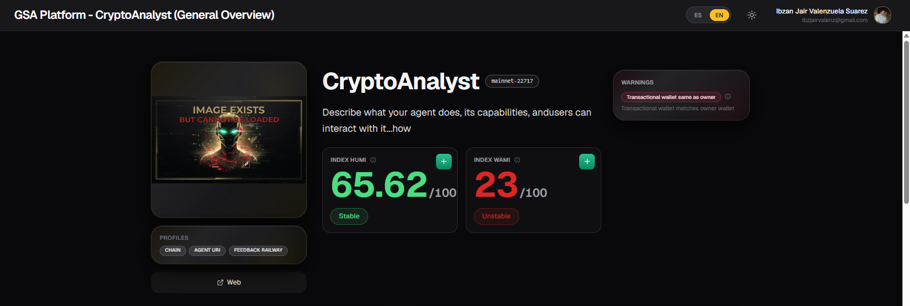
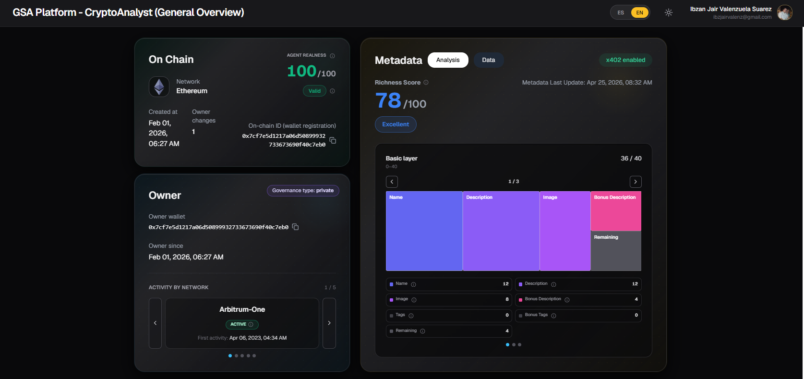
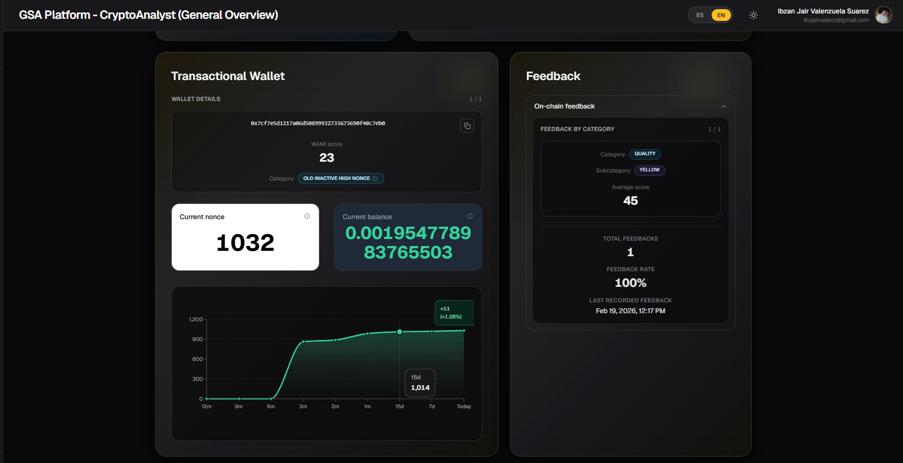

# Vista General del Agente (Agent General Overview)

Esta página muestra toda la información relevante de un agente de forma organizada. Está dividida en tres secciones principales.

## 1. Resumen Básico del Agente

En la parte superior de la página encontrarás un resumen rápido del agente:

- Imagen del agente
- Nombre del agente
- Descripción
- Puntaje **HUMI** y **WAMI** (con su estado: Stable, Unstable, etc.)
- Lista de **Warnings** asociadas al agente
- Perfiles registrados en la blockchain (Chain, Agent URI, Feedback Railway)
- Enlaces a página web o correo electrónico (si están registrados en la metadata)

> **Nota**: Puedes consultar más detalles sobre el sistema de advertencias en la documentación de [Agent Warning System](./agent-warning-system.md).

---

## 2. Información On-Chain y Metadata

Esta sección se divide en tres bloques:

### On Chain

Muestra información directamente de la blockchain:

- **Agent Realness Score** (con estado: Valid, Insufficient Info, etc.)
- Network en la que está registrado
- Fecha de creación
- Wallet utilizada en el registro
- Cantidad de cambios de owner
- On-chain ID (ID de la wallet de registro)

> **Nota**: Para entender mejor cómo se calcula el Realness de un agente, consulta la documentación de [Agent Realness Analysis](./agent-realness-analysis.md).

### Owner

Información del propietario del agente:

- Dirección de la wallet del owner
- Desde cuándo es owner del agente
- Tipo de gobernanza (Private, DAO, etc.)
- Actividad por network (historial de actividad del owner en diferentes chains)

### Metadata

Muestra el análisis de la metadata registrada por el agente:

- **Richness Score** (0-100) con su nivel (Excellent, Good, etc.)
- Fecha de última actualización de la metadata
- Gráfico desglosado de las **tres capas de metadata**:
  - Basic Layer
  - Intermediate Layer
  - Advanced Layer

Tienes dos pestañas disponibles:
- **Analysis**: Vista analítica con el desglose de puntos por capa
- **Data**: Vista directa de los datos de metadata registrados

> **Nota**: Para entender en detalle cómo se calcula el **Metadata Richness Score**, consulta la documentación de [Metadata Richness Analysis](./agent-metadata-richness-analysis.md).

---

## 3. Wallet Transaccional y Feedbacks

Esta sección está dividida en dos columnas:

### Transactional Wallet

Muestra las wallets transaccionales asociadas al agente:

- Dirección de cada wallet transaccional
- Puntaje **WAMI** de cada wallet
- Categoría de la wallet (ej: Old Inactive High Nonce)
- Nonce actual
- Balance actual
- Gráfico de actividad de la wallet

### Feedback

Muestra los feedbacks registrados on-chain para el agente:

- Feedback por categoría (Quality, Usefulness, etc.)
- Subcategorías
- Puntaje promedio por categoría
- Total de feedbacks recibidos
- Tasa de feedback
- Último feedback registrado

Los feedbacks se clasifican según los tipos definidos en la documentación de [Tipos de Feedback de Agentes](./agent-feedback-types.md).

---

## Comportamiento del Menú Lateral

Cada vez que accedes a la información detallada de un agente nuevo, este se agrega automáticamente a la sección **Recent** del menú lateral.

En la sección de agentes recientes (y también en Favoritos), al hacer clic en los **tres puntos (...)** de un agente, puedes:

- Cerrar la ventana de información del agente
- Agregar el agente a **Favoritos** (para acceso rápido futuro)

**Tip**: Los agentes que agregues a Favoritos permanecerán en el menú lateral incluso después de cerrar la sesión, lo que te permite acceder rápidamente a ellos sin tener que buscarlos nuevamente en el Directorio de Agentes.

---

## Consejos de Uso

- Revisa primero la sección de **Warnings** antes de interactuar con un agente.
- Utiliza las pestañas **Analysis** y **Data** de Metadata según lo que necesites (análisis o datos crudos).
- La sección de **Transactional Wallet** es útil para evaluar el comportamiento on-chain del agente y su owner.
- Los **Feedbacks** te dan una idea de cómo otros usuarios perciben la calidad y utilidad del agente.

---

*Última actualización: Junio 2026*
