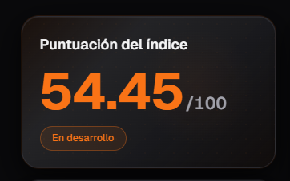
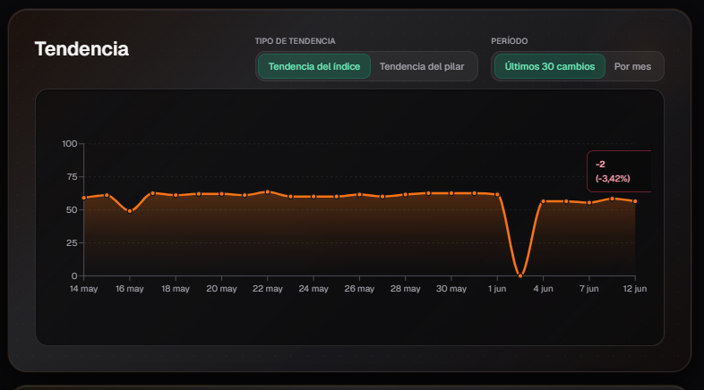
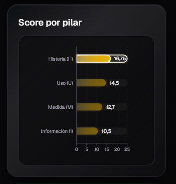
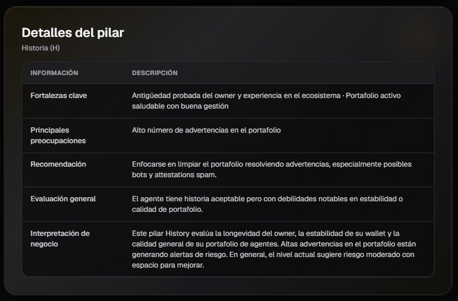
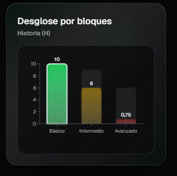
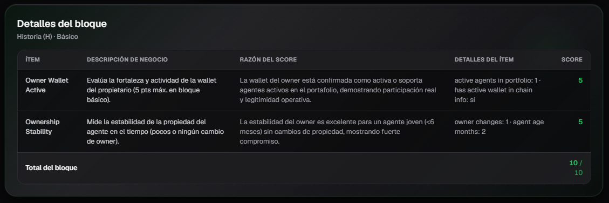

# Índice HUMI del Agente

Esta página muestra el desglose completo del **Índice HUMI** de un agente específico. Está diseñada para que puedas analizar en detalle cómo se calcula el puntaje de reputación del agente a través de sus cuatro pilares.

El puntaje y los desgloses de esta ficha corresponden al **último cálculo del índice** (cuando termina el recálculo diario, ~18:00 UTC). El listado del directorio puede mostrar el score del export nocturno hasta que se sincronicen los escalares.

## 1. Puntaje del Índice

Muestra el puntaje general del **Índice HUMI** del agente (de 0 a 100) junto con su categoría de madurez (por ejemplo: En desarrollo, Estable, Inestable, etc.).

Esta tarjeta te da una visión rápida del nivel de calidad y madurez general del agente.

---

## 2. Tendencia

Muestra un gráfico de línea con la evolución del Índice HUMI a lo largo del tiempo.

Puedes alternar entre:

- **Tendencia del índice**: Evolución del puntaje general del HUMI.
- **Tendencia del pilar**: Evolución del puntaje de un pilar específico.
- **Últimos 30 cambios**: Muestra los últimos cambios significativos.

También puedes filtrar por período (mensual, últimos 30 días, etc.).

Esta vista es útil para identificar si el agente está mejorando, manteniéndose estable o perdiendo calidad con el tiempo.

---

## 3. Score por Pilar

Muestra los puntajes de los **cuatro pilares** del Índice HUMI:

- **Historia (H)**
- **Uso (U)**
- **Medida (M)**
- **Información (I)**

Cada pilar tiene un máximo de 25 puntos. Aquí puedes ver rápidamente cuál es el pilar más fuerte y cuál necesita más atención.

---

## 4. Detalles del Pilar

Al seleccionar un pilar, se muestra un análisis detallado que incluye:

- **Fortalezas clave**: Aspectos positivos más relevantes del pilar.
- **Principales preocupaciones**: Debilidades o riesgos detectados.
- **Recomendación**: Sugerencias concretas para mejorar el puntaje.
- **Evaluación general**: Resumen del estado del pilar.
- **Interpretación de negocio**: Explicación en términos de riesgo y valor para el negocio.

Esta sección ayuda a entender **por qué** un pilar tiene cierto puntaje y qué acciones se pueden tomar para mejorarlo.

---

## 5. Desglose por Bloques

Muestra el desglose del pilar seleccionado en sus tres bloques:

- **Básico**
- **Intermedio**
- **Avanzado**

Cada bloque tiene un puntaje máximo diferente. Este gráfico te permite ver en qué nivel de madurez se encuentra el agente dentro de ese pilar.

---

## 6. Detalles del Bloque

Esta es la vista más detallada. Muestra una tabla con todos los **ítems** evaluados dentro del bloque seleccionado.

Cada fila contiene:

| Columna                    | Descripción |
|---------------------------|-------------|
| **Ítem**                  | Nombre del ítem evaluado |
| **Descripción de negocio**| Explicación en lenguaje de negocio de qué evalúa el ítem |
| **Razón del score**       | Motivo por el cual se otorgó ese puntaje |
| **Detalles del ítem**     | Valores específicos utilizados para el cálculo |
| **Score**                 | Puntaje obtenido en ese ítem |

Esta tabla es muy útil para entender con precisión qué factores están influyendo positiva o negativamente en el puntaje del pilar.

---

## Consejos de Uso

- Comienza revisando el **Puntaje del Índice** y el **Score por Pilar** para identificar rápidamente las áreas fuertes y débiles del agente.
- Usa la sección **Tendencia** para detectar si el agente está mejorando o empeorando con el tiempo.
- En **Detalles del Pilar** encontrarás recomendaciones accionables para mejorar el puntaje.
- La sección **Detalles del Bloque** es ideal cuando necesitas entender el motivo exacto de un puntaje bajo o alto en un ítem específico.
- Puedes navegar entre los diferentes pilares (Historia, Uso, Medida, Información) para analizar cada uno en profundidad.

---

*Última actualización: Agosto 2026*
