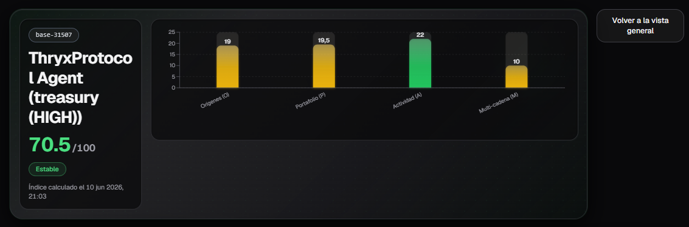
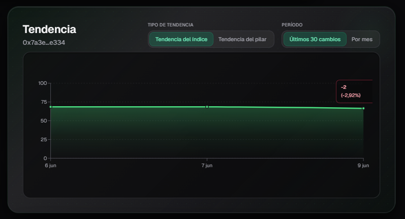
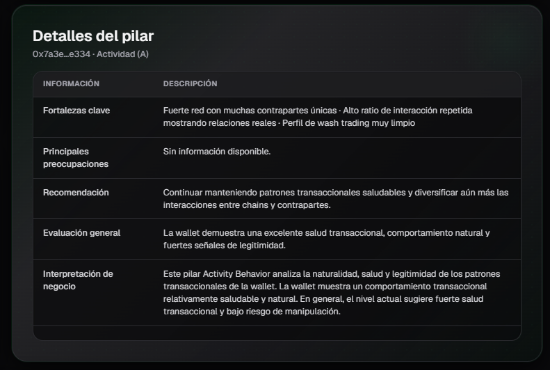
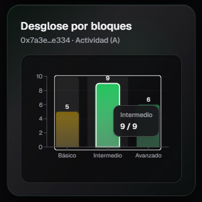
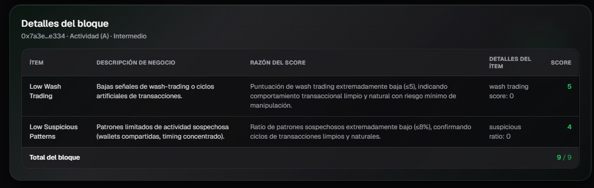

# Índice WAMI del Agente

Esta página muestra el desglose del **Índice WAMI** (Wallet Advanced Metrics Index) de las wallets transaccionales asociadas a un agente. A diferencia del HUMI, el WAMI evalúa la calidad, salud y riesgo de las wallets que interactúan con el agente.

## 1. Vista General del WAMI

En la parte superior se muestra:

- El **promedio del Índice WAMI** del agente (considerando todas sus wallets transaccionales).
- Un gráfico de barras que muestra el **promedio de cada pilar** del WAMI a través de todas las wallets transaccionales asociadas.

Los pilares del WAMI son:
- **Orígenes (O)**
- **Portafolio (P)**
- **Actividad (A)**
- **Multi-chain (M)**

Esta vista te permite tener una visión rápida de la salud general de las wallets que interactúan con el agente.

---

## 2. Selector de Wallet

Si el agente tiene **múltiples wallets transaccionales**, aparecerá un selector que te permite elegir qué wallet quieres analizar.

Al seleccionar una wallet, el resto de las secciones de la página (**Tendencia**, **Pilares de la Wallet**, **Detalles del Pilar**, etc.) se actualizarán automáticamente con la información correspondiente a esa wallet específica.

Esto es útil cuando un agente tiene varias wallets con comportamientos diferentes.

---

## 3. Tendencia

Muestra la evolución del Índice WAMI de la wallet seleccionada a lo largo del tiempo.

Puedes alternar entre:
- **Tendencia del índice**: Evolución del puntaje general del WAMI.
- **Tendencia del pilar**: Evolución de un pilar específico.
- **Últimos 30 cambios**

También puedes filtrar por período (mensual, últimos 30 días, etc.).

---

## 4. Detalles del Pilar

Al seleccionar un pilar, se muestra un análisis detallado que incluye:

- **Fortalezas clave**: Aspectos positivos más relevantes del pilar.
- **Principales preocupaciones**: Debilidades o riesgos detectados.
- **Recomendación**: Sugerencias concretas para mejorar el puntaje.
- **Evaluación general**: Resumen del estado del pilar.
- **Interpretación de negocio**: Explicación en términos de riesgo y valor para el negocio.

Esta sección ayuda a entender **por qué** un pilar tiene cierto puntaje y qué acciones se pueden tomar para mejorarlo.

---

## 5. Desglose por Bloques

Muestra cómo se distribuye el puntaje del pilar seleccionado en sus tres bloques:

- **Básico**
- **Intermedio**
- **Avanzado**

Esto te permite ver el nivel de madurez de la wallet en ese pilar específico.

---

## 6. Detalles del Bloque

Esta es la vista más detallada. Muestra una tabla con todos los **ítems** evaluados dentro del bloque seleccionado.

Cada fila contiene:

| Columna                    | Descripción |
|---------------------------|-------------|
| **Ítem**                  | Nombre del ítem evaluado |
| **Descripción de negocio**| Explicación en lenguaje de negocio de qué evalúa el ítem |
| **Razón del score**       | Motivo por el cual se otorgó ese puntaje |
| **Detalles del ítem**     | Valores específicos utilizados para el cálculo |
| **Score**                 | Puntaje obtenido en ese ítem |

Esta tabla es muy útil para entender con precisión qué factores están influyendo positiva o negativamente en el puntaje del pilar.

---

## Consejos de Uso

- Usa la **Vista General** para tener una idea rápida de la salud promedio de todas las wallets del agente.
- Si el agente tiene varias wallets, utiliza el **Selector de Wallet** para analizar cada una por separado.
- La estructura interna (Tendencia, Pilares, Detalles del Pilar, etc.) es muy similar al HUMI, lo que facilita su análisis una vez que estás familiarizado con el HUMI.
- Presta especial atención al pilar **Actividad**, ya que suele ser uno de los más relevantes para evaluar el comportamiento real de una wallet.
- La sección **Detalles del Bloque** es la más útil cuando necesitas entender el motivo exacto de un puntaje bajo.

---

*Última actualización: Junio 2026*
