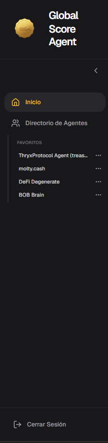
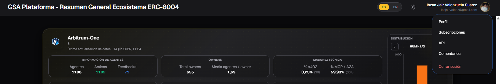
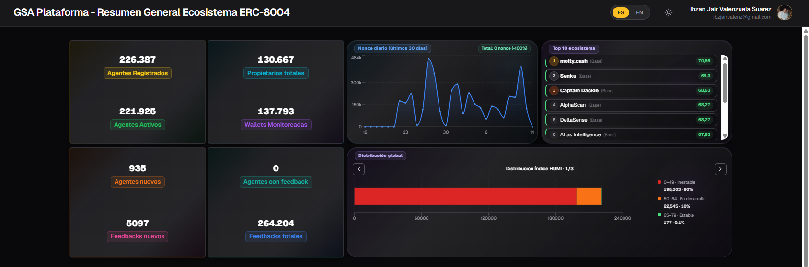
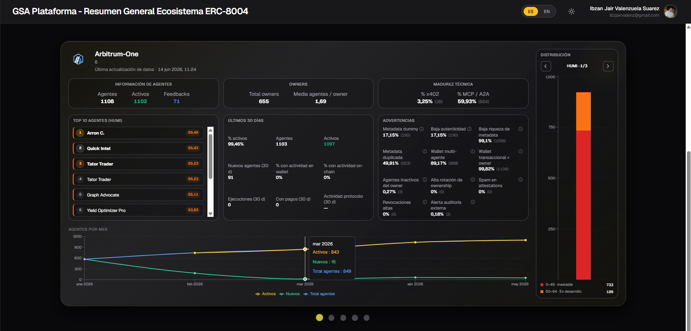

# Inicio (Home)

La página **Inicio** es la pantalla principal del Dashboard. Aquí puedes ver un resumen general del estado del ecosistema ERC-8004 y analizar en detalle cada una de las chains que se están monitoreando.

## Estructura General de la Página

La página de Inicio está dividida en las siguientes partes:

- Menú Lateral (izquierda)
- Menú Superior (derecha)
- Sección Superior (resumen general del ecosistema)
- Sección Inferior (detalle por chain)

---

### 1. Menú Lateral

El menú lateral se encuentra en la parte izquierda de la pantalla y permite una navegación rápida por la plataforma.

Incluye las siguientes opciones:

- **Inicio**: Te lleva a la página actual (resumen general).
- **Directorio de Agentes**: Acceso al listado completo de agentes registrados.
- **Favoritos**: Lista de agentes que has marcado como favoritos para acceso rápido.
- **Búsquedas recientes**: Agentes que has consultado recientemente.

**Tip**: Utiliza la sección de **Favoritos** para tener a mano los agentes que más te interesan sin tener que buscarlos cada vez.

---

### 2. Menú Superior (Perfil)

En la esquina superior derecha encontrarás tu perfil de usuario. Al hacer clic sobre él, se despliega un menú con las siguientes opciones:

- **Perfil**
- **Suscripciones**
- **API**
- **Comentarios** (Feedbacks)
- **Cerrar sesión**

**Tip**: Desde aquí puedes acceder rápidamente a la gestión de tu cuenta y configuraciones sin tener que navegar por otras secciones.

---

### 3. Sección Superior - Resumen General del Ecosistema

Esta sección muestra información agregada de **todas las chains** monitoreadas (BNB Chain, Arbitrum, Ethereum, Polygon y Base).

#### KPIs Principales

Se muestran **8 indicadores clave** que te dan una visión rápida del ecosistema:

| Indicador                    | Qué significa                                                                 | Recomendación de uso |
|-----------------------------|-------------------------------------------------------------------------------|----------------------|
| **Agentes Registrados**     | Total de agentes registrados en la plataforma                                 | Ideal para ver el crecimiento general del ecosistema |
| **Agentes Activos**         | Agentes marcados como activos en su registro en la blockchain                 | Indicador de agentes que están operativos según su registro on-chain |
| **Propietarios totales**    | Cantidad de wallets que poseen agentes                                        | Útil para entender la distribución de ownership |
| **Wallets Monitoreadas**    | Wallets que están siendo monitoreadas activamente                             | Refleja el alcance del sistema de monitoreo |
| **Agentes nuevos**          | Agentes nuevos registrados en la blockchain el día anterior                   | Sirve para medir el ritmo diario de nuevos registros |
| **Agentes con feedback**    | Agentes que han recibido al menos un feedback                                 | Muestra qué tan interactuado está el ecosistema |
| **Feedbacks nuevos**        | Feedbacks nuevos registrados en la blockchain el día anterior                 | Indica la actividad diaria de retroalimentación |
| **Feedbacks totales**       | Total de feedbacks registrados                                                | Métrica de madurez del ecosistema |

#### Nonce Diario (Últimos 30 días)

Gráfico de línea que muestra la actividad diaria de los agentes (medida en Nonce) durante los últimos 30 días.

#### Top 10 Agentes del Ecosistema

Listado de los **10 agentes con mejor Índice HUMI** de todo el ecosistema.

#### Gráficos de Distribución Global

Tres gráficos que muestran cómo se distribuyen los agentes según:

- **Índice HUMI**
- **Índice WAMI**
- **Riqueza de Metadata**

---

### 4. Sección Inferior - Resumen por Chain

En esta sección puedes analizar **cada chain de forma individual**. Puedes cambiar de chain usando el selector superior.

#### 4.1 Información de Agentes

Muestra datos básicos de los agentes en esa chain:

- **Agentes**: Total de agentes registrados
- **Activos**: Agentes marcados como activos en su registro en la blockchain
- **Feedbacks**: Cantidad total de feedbacks recibidos

**Tip**: Compara la cantidad de agentes activos vs totales para entender qué tan "vivo" está el ecosistema en esa chain.

#### 4.2 Información de Owners

- **Total owners**: Cantidad de wallets propietarias
- **Media agentes / owner**: Promedio de agentes por wallet

**Tip**: Un promedio alto puede indicar que hay wallets que controlan muchos agentes (posiblemente equipos o proyectos grandes).

#### 4.3 Madurez Técnica

Porcentaje de agentes que soportan tecnologías avanzadas:

- **% x402**: Porcentaje de agentes que soportan el protocolo de pagos x402
- **% MCP / A2A**: Porcentaje de agentes compatibles con Model Context Protocol o Agent-to-Agent

**Tip**: Estos porcentajes son buenos indicadores de qué tan avanzados técnicamente están los agentes de esa chain.

#### 4.4 Top 10 Agentes (basado en HUMI)

Listado de los 10 agentes con mejor puntaje **HUMI** dentro de esa chain específica.

**Tip**: Úsalo para descubrir rápidamente los mejores agentes de una chain en particular.

#### 4.5 Actividad de los Agentes (Últimos 30 días)

Estadísticas de actividad reciente:

- **% activos**
- **Nuevos agentes** (últimos 30 días)
- **% con actividad en wallet**
- **% con actividad on-chain**
- **Ejecuciones** realizadas
- **Pagos** realizados
- **Actividad en protocolos**

**Tip**: Esta sección es muy útil para evaluar si una chain está creciendo en uso real o solo en registro de agentes.

#### 4.6 Rate de Agent Warning (Advertencias)

Desglose de las diferentes advertencias detectadas en los agentes de la chain, tales como:

- Metadata dummy
- Baja autenticidad
- Baja riqueza de metadata
- Metadata duplicada
- Wallet multi-agente
- Wallet transaccional = owner
- Agentes inactivos del owner
- Alta rotación de ownership
- Spam en attestations
- Revocaciones altas
- Alerta de auditoría externa

**Tip**: Revisa esta sección antes de interactuar con agentes de una chain nueva. Un alto porcentaje de ciertas advertencias puede ser una señal de alerta.

#### 4.7 Distribución de Índices

Gráficos que muestran cómo se distribuyen los agentes de la chain según:

- **Índice HUMI**
- **Índice WAMI**
- **Riqueza de Metadata**

#### 4.8 Evolución de Agentes (Gráfico de Línea)

Gráfico que muestra la evolución histórica de los agentes en esa chain específica, incluyendo:

- **Total de agentes**
- **Agentes Activos**
- **Agentes Nuevos**

**Tip**: Observa la tendencia de los últimos meses para entender si la chain está creciendo, estancada o en declive.

---

## Consejos Generales de Uso

- Usa la **sección superior** cuando quieras tener una visión rápida del ecosistema completo.
- Baja a la **sección inferior** cuando necesites analizar una chain específica.
- Combina el **Top 10 HUMI** con los gráficos de distribución para encontrar agentes de alta calidad.
- Revisa las **Advertencias** antes de interactuar con agentes de chains nuevas.
- Guarda como **favoritos** los agentes que más uses desde el menú lateral.

---

*Última actualización: Junio 2026*
