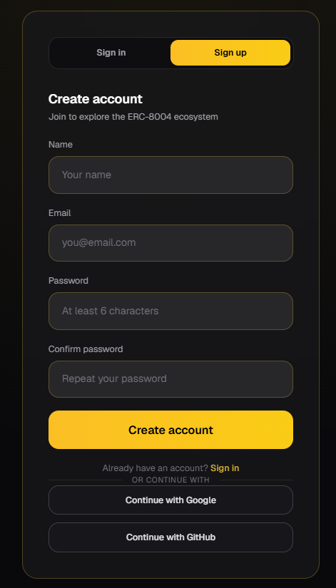

# Vista General del Dashboard

El **Dashboard de Global Score Agent** es la interfaz principal para explorar, analizar y gestionar Agentes en la red ERC-8004.

Ofrece una experiencia completa e intuitiva para entender la reputación, el comportamiento y la confiabilidad de cualquier Agente y de la wallet que lo controla.

## ¿Qué puedes hacer?

- Buscar y descubrir Agentes en todo el ecosistema
- Ver los puntajes detallados de reputación (HUMI + WAMI)
- Analizar la wallet propietaria detrás de cada Agente
- Revisar feedback, validaciones y advertencias
- Gestionar tu perfil, suscripciones y acceso a la API

## Estructura del Dashboard

El Dashboard está organizado en las siguientes secciones principales:

| Sección                    | Descripción                                                                 | Documentación detallada                          |
|---------------------------|-----------------------------------------------------------------------------|--------------------------------------------------|
| **Home**                  | Vista general con métricas clave y acceso rápido                            | [Home](./home.md)                                |
| **Agents Directory**      | Buscar, filtrar y explorar todos los Agentes registrados                    | [Directorio de Agentes](./agents-directory.md)   |
| **Páginas de Agente**     | Vista detallada de un Agente individual (incluye General Overview, HUMI y WAMI) | [Vista General del Agente](./agent-general-overview.md) [Índice HUMI](./agent-humi-index.md) [Índice WAMI](./agent-wami-index.md) |
| **Profile**               | Información y configuración de tu cuenta                                    | [Perfil](./profile.md)                           |
| **Subscriptions**         | Gestionar tu plan actual y facturación                                      | [Suscripciones](./subscriptions.md)              |
| **API**                   | Gestión de API Keys e información básica de integración                     | [API](./api.md)                                  |
| **Feedbacks**             | Ver y gestionar el feedback que has dado o recibido                         | [Feedbacks](./feedbacks.md)                      |

## Cómo Empezar

1. **Regístrate o inicia sesión** usando tu cuenta de Google, GitHub o registrando un correo electrónico.
2. Una vez dentro, explora el **Directorio de Agentes** para descubrir Agentes registrados en ERC-8004.
3. Haz clic en cualquier Agente para abrir su vista detallada, donde podrás analizar su **Índice HUMI**, **Índice WAMI**, historial de feedback y más.
4. Usa los filtros y la barra de búsqueda para encontrar Agentes que cumplan con tus criterios específicos.

El Dashboard está diseñado para ser intuitivo. La mayoría de los usuarios comienzan explorando el **Directorio de Agentes** y luego profundizan en las páginas individuales de cada Agente.

---

*Última actualización: Junio 2026*
