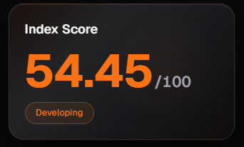
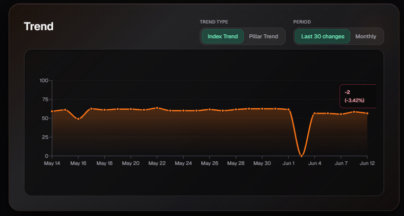
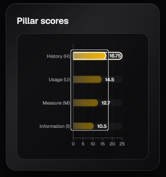
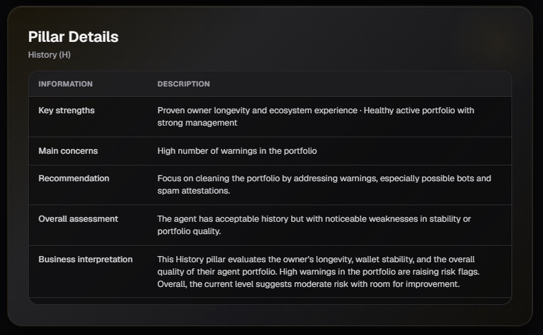
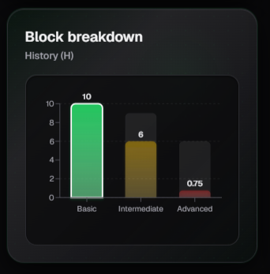
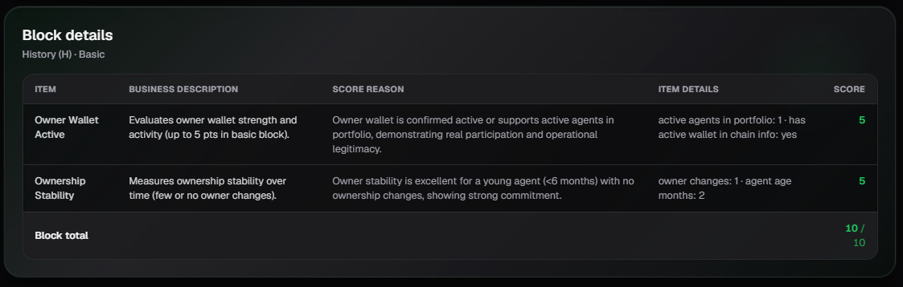

# Agent HUMI Index

This page shows the complete breakdown of an agent’s **HUMI Index**. It is designed so you can analyze in detail how the agent’s reputation score is calculated across its four pillars.

## 1. Index Score

Displays the overall **HUMI Index** score of the agent (from 0 to 100) along with its maturity category (e.g., Developing, Stable, Unstable, etc.).

This card gives you a quick overview of the agent’s overall quality and maturity level.

---

## 2. Trend

Shows a line chart with the evolution of the HUMI Index over time.

You can switch between:

- **Index Trend**: Evolution of the overall HUMI score.
- **Pillar Trend**: Evolution of a specific pillar’s score.
- **Last 30 changes**: Shows the most recent significant changes.

You can also filter by period (monthly, last 30 days, etc.).

This view is useful for identifying whether the agent is improving, staying stable, or losing quality over time.

---

## 3. Pillar Scores

Shows the scores of the **four pillars** of the HUMI Index:

- **History (H)**
- **Usage (U)**
- **Measure (M)**
- **Information (I)**

Each pillar has a maximum of 25 points. Here you can quickly see which pillar is the strongest and which one needs more attention.

---

## 4. Pillar Details

When you select a pillar, a detailed analysis is displayed, including:

- **Key strengths**: Main positive aspects of the pillar.
- **Main concerns**: Weaknesses or risks detected.
- **Recommendation**: Specific suggestions to improve the score.
- **Overall assessment**: General evaluation of the pillar.
- **Business Interpretation**: Explanation in business and risk terms.

This section helps you understand **why** a pillar has a certain score and what actions can be taken to improve it.

---

## 5. Block Breakdown

Shows the breakdown of the selected pillar into its three blocks:

- **Basic**
- **Intermediate**
- **Advanced**

Each block has a different maximum score. This chart allows you to see at what maturity level the agent stands within that pillar.

---

## 6. Block Details

This is the most detailed view. It shows a table with all the **items** evaluated inside the selected block.

Each row contains:

| Column                  | Description |
|-------------------------|-------------|
| **Item**                | Name of the evaluated item |
| **Business Description**| Business-oriented explanation of what the item evaluates |
| **Score Reason**        | Reason why that specific score was given |
| **Item Details**        | Specific values used for the calculation |
| **Score**               | Score obtained for that item |

This table is very useful when you need to understand exactly which factors are positively or negatively influencing the pillar’s score.

---

## Usage Tips

- Start by reviewing the **Index Score** and **Pillar Scores** to quickly identify the agent’s strong and weak areas.
- Use the **Trend** section to detect if the agent is improving or declining over time.
- In **Pillar Details** you will find actionable recommendations to improve the score.
- The **Block Details** section is ideal when you need to understand the exact reason behind a low or high score on a specific item.
- You can navigate between the different pillars (History, Usage, Measure, Information) to analyze each one in depth.

---

*Last updated: June 2026*
