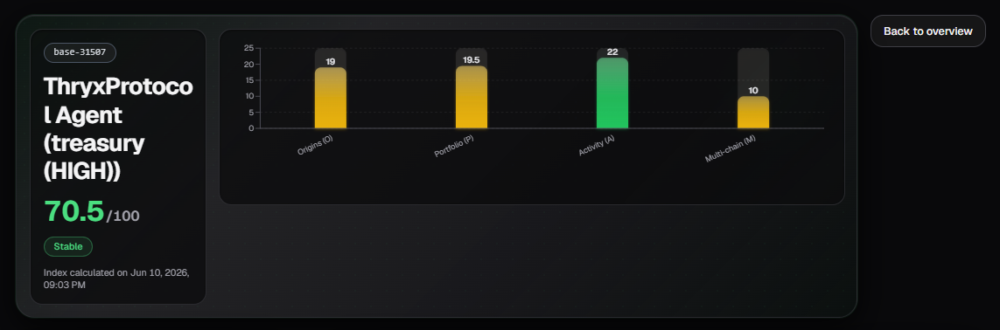
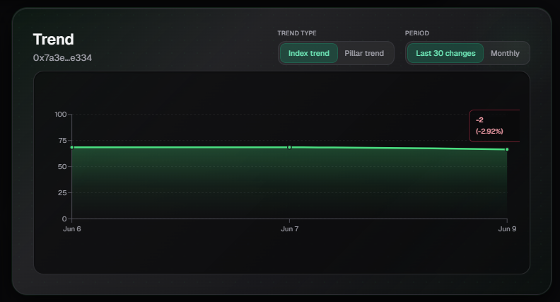
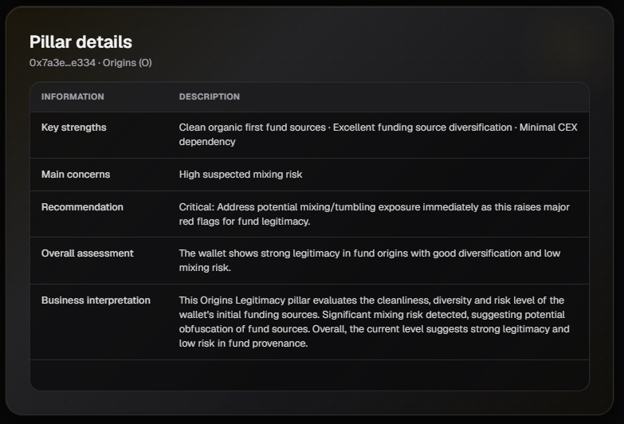
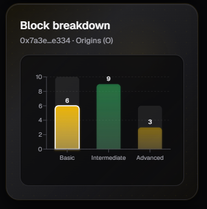
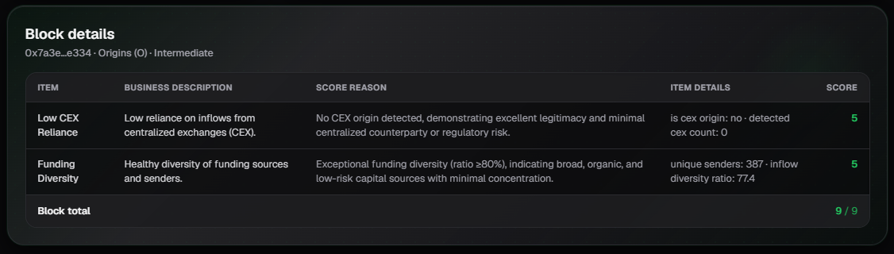

# Agent WAMI Index

This page displays the breakdown of the **WAMI Index** (Wallet Advanced Metrics Index) for the transactional wallets associated with an agent. Unlike HUMI, WAMI evaluates the quality, health, and risk level of the wallets interacting with the agent.

## 1. General WAMI Overview

At the top of the page, you can see:

- The **average WAMI Index** score of the agent (considering all its transactional wallets).
- A bar chart showing the **average score of each pillar** across all transactional wallets associated with the agent.

The WAMI pillars are:
- **Origins (O)**
- **Portfolio (P)**
- **Activity (A)**
- **Multi-chain (M)**

This view gives you a quick overview of the overall health of the wallets interacting with the agent.

---

## 2. Wallet Selector

If the agent has **multiple transactional wallets**, a selector will appear allowing you to choose which wallet you want to analyze.

When you select a wallet, the rest of the sections on the page (**Trend**, **Wallet Pillars**, **Pillar Details**, etc.) will automatically update with the information corresponding to that specific wallet.

This is useful when an agent has multiple wallets with different behaviors.

---

## 3. Trend

Shows the evolution of the WAMI Index for the selected wallet over time.

You can switch between:
- **Index Trend**: Evolution of the overall WAMI score.
- **Pillar Trend**: Evolution of a specific pillar.
- **Last 30 changes**

You can also filter by period (monthly, last 30 days, etc.).

---

## 4. Pillar Details

When you select a pillar, a detailed analysis is displayed, including:

- **Key strengths**: Most relevant positive aspects of the pillar.
- **Main concerns**: Weaknesses or risks detected.
- **Recommendation**: Specific suggestions to improve the score.
- **Overall assessment**: Summary of the pillar’s current state.
- **Business Interpretation**: Explanation in terms of risk and business value.

This section helps you understand **why** a pillar has a certain score and what actions can be taken to improve it.

---

## 5. Block Breakdown

Shows how the score of the selected pillar is distributed across its three blocks:

- **Basic**
- **Intermediate**
- **Advanced**

This allows you to see the maturity level of the wallet within that specific pillar.

---

## 6. Block Details

This is the most detailed view. It shows a table with all the **items** evaluated inside the selected block.

Each row contains:

| Column                  | Description |
|-------------------------|-------------|
| **Item**                | Name of the evaluated item |
| **Business Description**| Business-oriented explanation of what the item evaluates |
| **Score Reason**        | Reason why that specific score was given |
| **Item Details**        | Specific values used for the calculation |
| **Score**               | Score obtained for that item |

This table is very useful for understanding exactly which factors are positively or negatively influencing the pillar’s score.

---

## Usage Tips

- Use the **General Overview** to get a quick idea of the average health of all the agent’s wallets.
- If the agent has multiple wallets, use the **Wallet Selector** to analyze each one separately.
- The internal structure (Trend, Pillar Details, Block Breakdown, etc.) is very similar to HUMI, making it easier to analyze once you are familiar with the HUMI page.
- Pay special attention to the **Activity** pillar, as it is often one of the most relevant for evaluating a wallet’s real behavior.
- The **Block Details** section is the most useful when you need to understand the exact reason behind a low score.

---

*Last updated: June 2026*
