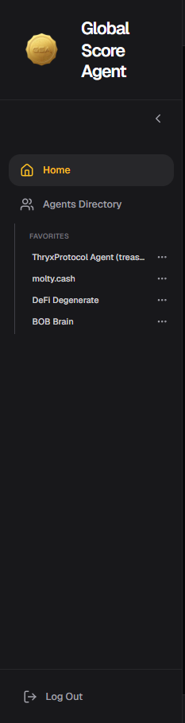
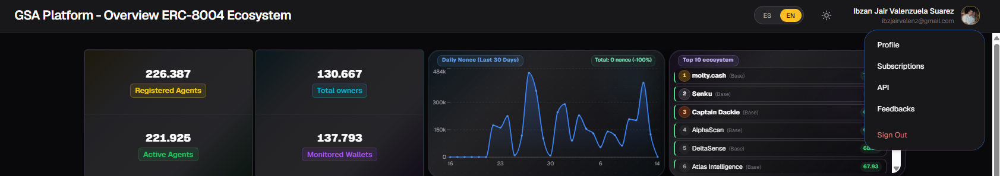
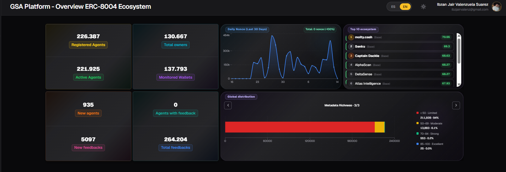
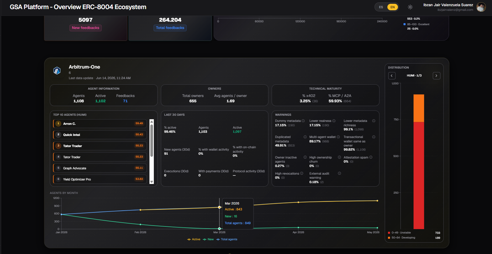

# Home

The **Home** page is the main screen of the Dashboard. Here you can see a general overview of the ERC-8004 ecosystem status and analyze each monitored chain in detail.

## Page Structure

The Home page is divided into the following sections:

- Left Sidebar Menu
- Top Menu (Profile)
- Upper Section (Global Ecosystem Summary)
- Lower Section (Per Chain Summary)

---

### 1. Left Sidebar Menu

The left sidebar allows quick navigation through the platform.

It includes:

- **Home**: Takes you to the current page (general overview).
- **Agents Directory**: Access to the full list of registered agents.
- **Favorites**: List of agents you have marked as favorites for quick access.
- **Recent Searches**: Agents you have recently viewed.

**Tip**: Use the **Favorites** section to keep your most important agents easily accessible.

---

### 2. Top Menu (Profile)

In the top right corner, you will find your user profile. Clicking on it opens a menu with the following options:

- **Profile**
- **Subscriptions**
- **API**
- **Feedbacks**
- **Sign Out**

**Tip**: From here you can quickly access your account settings and configuration without navigating through other sections.

---

### 3. Upper Section - Global Ecosystem Summary

This section displays aggregated information from **all monitored chains** (BNB Chain, Arbitrum, Ethereum, Polygon, and Base).

#### Main KPIs

There are **8 key indicators** that give you a quick overview of the ecosystem:

| Indicator                    | Meaning                                                                          | Usage Tip |
|-----------------------------|----------------------------------------------------------------------------------|-----------|
| **Agents Registered**       | Total number of agents registered on the platform                                | Useful to see overall ecosystem growth |
| **Agents Active**           | Agents marked as active in their on-chain registration                           | Indicates how many agents are currently operational |
| **Total Owners**            | Total number of wallets that own agents                                          | Helps understand ownership distribution |
| **Wallets Monitored**       | Wallets currently being actively monitored                                       | Shows the reach of the monitoring system |
| **New Agents**              | Agents newly registered on the blockchain the previous day                       | Measures daily registration pace |
| **Agents with Feedback**    | Agents that have received at least one feedback                                  | Shows how interactive the ecosystem is |
| **New Feedbacks**           | New feedbacks registered on the blockchain the previous day                      | Indicates daily feedback activity |
| **Total Feedbacks**         | Total number of feedbacks registered on the platform                             | Maturity metric of the ecosystem |

#### Daily Nonce (Last 30 Days)

Line chart showing daily agent activity (measured in Nonce) over the last 30 days.

#### Top 10 Agents in the Ecosystem

List of the **10 agents with the highest HUMI Index** across the entire ecosystem.

#### Global Distribution Charts

Three charts showing how agents are distributed according to:

- **HUMI Index**
- **WAMI Index**
- **Metadata Richness**

---

### 4. Lower Section - Per Chain Summary

This section allows you to analyze **each chain individually**. You can switch between chains using the selector at the top of this section.

#### 4.1 Agent Information

Basic data of agents on that chain:

- **Agents**: Total number of registered agents
- **Active**: Agents marked as active in their on-chain registration
- **Feedbacks**: Total number of feedbacks received

**Tip**: Compare active vs total agents to understand how "alive" the ecosystem is on that chain.

#### 4.2 Owner Information

- **Total owners**: Total number of wallets that own agents
- **Average agents / owner**: Average number of agents per owner wallet

**Tip**: A high average may indicate concentration of agents in few wallets (possibly teams or large projects).

#### 4.3 Technical Maturity

Percentage of agents supporting advanced technologies:

- **% x402**: Percentage of agents that support the x402 payment protocol
- **% MCP / A2A**: Percentage of agents compatible with Model Context Protocol or Agent-to-Agent

**Tip**: These percentages are good indicators of how technically advanced the agents on that chain are.

#### 4.4 Top 10 Agents (by HUMI)

List of the 10 agents with the highest **HUMI** score on that specific chain.

**Tip**: Use it to quickly discover the best agents on a particular chain.

#### 4.5 Agent Activity (Last 30 Days)

Recent activity statistics:

- **% Active**
- **New agents** (last 30 days)
- **% with wallet activity**
- **% with on-chain activity**
- **Executions** performed
- **Payments** made
- **Protocol activity**

**Tip**: This section is very useful to evaluate whether a chain has real usage or just agent registrations.

#### 4.6 Agent Warning Rate

Breakdown of warnings detected on agents of that chain, such as:

- Metadata dummy
- Low authenticity
- Low metadata richness
- Duplicate metadata
- Multi-agent wallet
- Transactional wallet = owner
- Inactive agents from owner
- High ownership rotation
- Spam in attestations
- High revocations
- External audit alert

**Tip**: Review this section before interacting with agents from a new chain. A high percentage of certain warnings can be a red flag.

#### 4.7 Index Distribution

Charts showing how agents on that chain are distributed according to:

- **HUMI Index**
- **WAMI Index**
- **Metadata Richness**

#### 4.8 Agent Evolution (Line Chart)

Chart showing the historical evolution of agents on that specific chain, including:

- **Total agents**
- **Active agents**
- **New agents**

**Tip**: Observe the trend over the last months to understand if the chain is growing, stagnant, or declining.

---

## General Usage Tips

- Use the **Upper Section** when you want a quick overview of the entire ecosystem.
- Go to the **Lower Section** when you need to analyze a specific chain in more depth.
- Combine the **Top 10 HUMI** with the distribution charts to find high-quality agents.
- Regularly check the **Warnings** section before interacting with agents from new chains.
- Use the sidebar to quickly access your favorite agents or recent searches.

---

*Last updated: June 2026*
